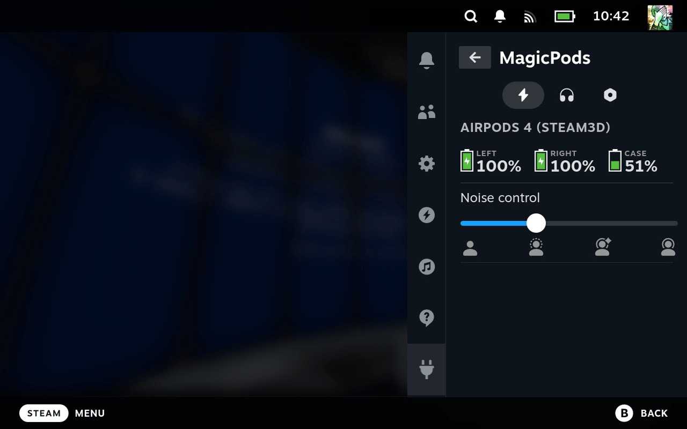

# MagicPods✨ for Steam Deck

A magic plugin for the Decky Loader that allows you to control your AirPods and Beats headphones in a comfortable way.

## 🎨 Features

🔋 Battery level  
⚙️ Noise control  
🔌 Fix headphones disconnects  
🎙️ Hotkey to mute microphone  
🔄 Hotkey to cycle between noise modes  
🎉 New features coming soon

## 🎧 Headphones supported

| Apple            | Beats                  | Samsung           |
| ---------------- | ---------------------- | ----------------- |
| AirPods 1        | PowerBeats Pro         | Galaxy Buds       |
| AirPods 2        | PowerBeats Pro 2       | Galaxy Buds Plus  |
| AirPods 3        | PowerBeats 3           | Galaxy Buds Live  |
| AirPods 4        | PowerBeats 4           | Galaxy Buds Pro   |
| AirPods 4 (ANC)  | Beats Fit Pro          | Galaxy Buds 2     |
| AirPods Pro      | Beats Studio Buds      | Galaxy Buds 2 Pro |
| AirPods Pro 2    | Beats Studio Buds Plus | Galaxy Buds Fe    |
| AirPods Max      | Beats Studio Pro       | Galaxy Buds 3     |
| AirPods Max 2024 | Beats Solo 3           | Galaxy Buds 3 Pro | 
|                  | Beats Solo Pro         |                   |
|                  | Beats Studio 3         |                   |
|                  | Beats X                |                   |
|                  | Beats Flex             |                   |

## 💾 Installation

### Using the Decky Store

1. Install [Decky Loader](https://github.com/SteamDeckHomebrew/decky-loader/tree/main?tab=readme-ov-file#-installation)
2. Switch to steam game mode
3. Press 
4. Go to the tab 
5. In the upper right corner, click 
6. Find `MagicPods` in the plugin list or search for it
7. Press the `Install` button

### Using the Decky developer mode

1. Install [Decky Loader](https://github.com/SteamDeckHomebrew/decky-loader/tree/main?tab=readme-ov-file#-installation)
2. Switch to steam game mode
3. Press 
4. Go to the tab 
5. In the upper right corner, click 
6. On the General tab, enable developer mode
7. Go to the Developer tab
8. Type in the URL `https://magicpods.app/plugin`
9. Press the Install button

## 🚀 Getting started

Now that you have MagicPods, press  and go to  and select  MagicPods in the installed plugins list.

 displays information about the current charge level and additional features, if supported by the headphones.  
 shows headphones supported by MagicPods, here you can connect/disconnect headphones and control Bluetooth.  
 Contains additional features, settings, and other useful information.  

All you need to do is select your headphones and connect them, and the charge level and additional features will appear on the  tab

## 🌐 Become a Translator

Go to the [MagicPods-SteamDeck](https://weblate.magicpods.app/engage/magicpods-steamdeck/) project. Register (don’t forget to check your Spam folder — the confirmation email might end up there), or suggest translations without creating an account.

Use the shortest phrases and abbreviations possible — the Steam interface is very compact. Refer to the screenshots attached to each phrase.

## 🧪 Ideas and bugs

In the [Discord](https://discord.com/invite/UyY4PY768V) community you can suggest an idea or report a problem.

## 🩼 Known issues

- Hotkeys stop working after opening the controller settings in the Steam menu — the solution is to restart the plugin.
- When managing Bluetooth through the plugin, changes are not visible in the Steam interface — the current Bluetooth status is shown only in MagicPods.

## 💰 Donate

[Support the project here](https://magicpods.app/donate/) — every bit helps ❤️

## 💖 Developers

Developed by [Aleksandr Maslov](https://github.com/steam3d/) and [Andrey Litvintsev](https://github.com/andreylitvintsev)