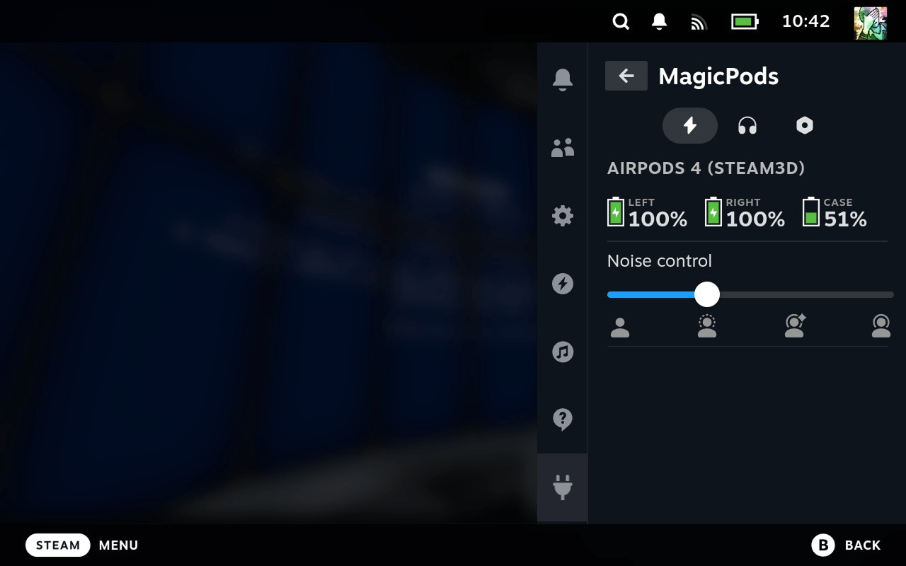

# MagicPods✨ for Steam Deck

Волшебный плагин для Decky Loader, который позволяет удобно управлять AirPods и Beats наушниками.

## 🎨 Функции

🔋 Уровень заряда батареи  
⚙️ Управление шумоподавлением  
🔌 Решение проблемы с отключением наушников  
🎉 Новые функции скоро

### 🔥 Эксклюзивно для AirPods и Beats

Дополнительные настройки — как на iPhone и Mac:

- Приглушение звука при разговоре
- Настройка уровня шума в адаптивном режиме
- Индивидуальная громкость
- Шумоподавление при использовании одного наушника
- Регулировка длительности нажатия
- Регулировка длительности нажатия и удержания
- Настройка одинарного и двойного нажатия для управления вызовами

## 🎧 Поддержка наушников

| Apple            | Beats                  | Samsung           |
| ---------------- | ---------------------- | ----------------- |
| AirPods 1        | PowerBeats Pro         | Galaxy Buds       |
| AirPods 2        | PowerBeats Pro 2       | Galaxy Buds Plus  |
| AirPods 3        | PowerBeats 3           | Galaxy Buds Live  |
| AirPods 4        | PowerBeats 4           | Galaxy Buds Pro   |
| AirPods 4 (ANC)  | Beats Fit Pro          | Galaxy Buds 2     |
| AirPods Pro      | Beats Studio Buds      | Galaxy Buds 2 Pro |
| AirPods Pro 2    | Beats Studio Buds Plus | Galaxy Buds Fe    |
| AirPods Pro 3    | Beats Studio Pro       | Galaxy Buds 3     |
| AirPods Max      | Beats Solo 3           | Galaxy Buds 3 Pro | 
| AirPods Max 2024 | Beats Solo Pro         |                   |
| AirPods Max 2    | Beats Studio 3         |                   |
|                  | Beats X                |                   |
|                  | Beats Flex             |                   |
|                  | Beats Solo Buds        |                   |
|                  | Powerbeats Fit         |                   |

## 💾 Установка

### Через Decky Store

1. Установите [Decky Loader](https://github.com/SteamDeckHomebrew/decky-loader/tree/main?tab=readme-ov-file#-installation)
2. Нажмите 
3. Перейдите на вкладку 
4. В правом верхнем углу нажмите 
5. Найдите `MagicPods` в списке плагинов или воспользуйтесь поиском
6. Нажмите `установить`

### Через режим разработчика

1. Установите [Decky Loader](https://github.com/SteamDeckHomebrew/decky-loader/tree/main?tab=readme-ov-file#-installation)
2. Нажмите 
3. Перейдите на вкладку 
4. В правом верхнем углу нажмите 
5. Включите режим разработчика на вкладке общее
6. Перейдите на вкладку разработчик
7. Напишите в URL `https://magicpods.app/plugin`
8. Нажмите `установить`

## 🚀 С чего начать

Теперь, когда у вас есть MagicPods, нажмите на  и перейдите на , выберите  в списке установленных плагинов выберите  MagicPods.

 отображается информация о текущем уровне заряда и дополнительных функций если их поддерживают наушники.  
 отображаются только наушники, которые поддерживает MagicPods, здесь вы можете подключать / отключать наушники и управлять Bluetooth.  
 содержит дополнительные функции, настройки и другую полезную информацию.  

Осталось дело за малым, выберите ваши наушники и подключите их, через мгновение уровень заряда и дополнительные функции появится на вкладке 

## 🌐 Стать переводчиком

Перейдите к проекту [MagicPods-SteamDeck](https://weblate.magicpods.app/engage/magicpods-steamdeck/). Зарегистрируйтесь (не забудьте проверить папку «Спам» — письмо с подтверждением регистрации может оказаться там) или вносите предложения по переводу без создания аккаунта.

Используйте как можно более короткие фразы и сокращения — интерфейс Steam очень компактный. Ориентируйтесь на скриншоты прикрепленные к каждой фразе.

## 🧪 Идеи и ошибки

Предложить идею или сообщить об можно в сообществе [Discord](https://discord.com/invite/UyY4PY768V)

## 🩼 Известные проблемы

- Горячие клавиши перестают работать после открытия настроек контроллера в меню Steam — решение: перезапустить плагин.
- При управлении Bluetooth через плагин изменения не видны в интерфейсе Steam — актуальное состояние отображается только в MagicPods.

## 💰 Поддержать проект

[Поддержите проект здесь](https://magicpods.app/donate/) — любая помощь важна ❤️

## 💖 Разработчики

Разработано [Aleksandr Maslov](https://github.com/steam3d/) и [Andrey Litvintsev](https://github.com/andreylitvintsev)